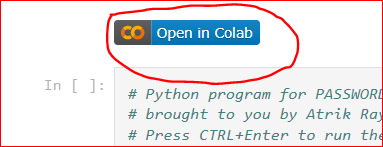

Thank you for choosing to contribute. 
Since this project uses Google Colab, which is an IPython notebook, there are some special requirements needed for contributing so that the project does not break.

Please check other branches already present in the main repo, the issues and the PRs before working on contributing to the repo.

1. Fork the repo.
2. Create a new branch with a descriptive name.
3. Open the Google Colab link. Verify and work on the code.
4. Clear the output before step 5.
5. File ->  Save a copy to GitHub. 
    * If GitHub and GColab are not integrated, you may have to work on integrating it. It is a simple OAuth work.
6. Choose the repo and the correct branch. 
    * It is often likely to miss the branch while choosing. (Telling from experience 😃)
7. Make sure to ✅ "Include a link to Colaboratory".
    * This will generate a "Open in Colab" button on TOP of the PWD-Generator.ipynb only, which will open the GColab link to the PWD-Generator.ipynb of your branch.
    * 
    * For example, the link will lead to https://colab.research.google.com/github/<YOUR GITHUB USERNAME>/PWD-Generator/blob/<YOUR BRANCH NAME>/PWD_Generator.ipynb
    * DO NOT CHANGE THE LINK IN THE END OF THE NOTEBOOK.
    * Please keep your link on top of the Notebook to the code of your branch so that your code can also be tested before being accepting and integrating.
8. Add a good title and description before generating a pull request.

For more doubts and discussions as a contributor, please contact at: https://github.com/AtrikGit6174/PWD-Generator/issues/new?assignees=AtrikGit6174&labels=help+wanted&template=contributors-q-a.md&title=
    
    
